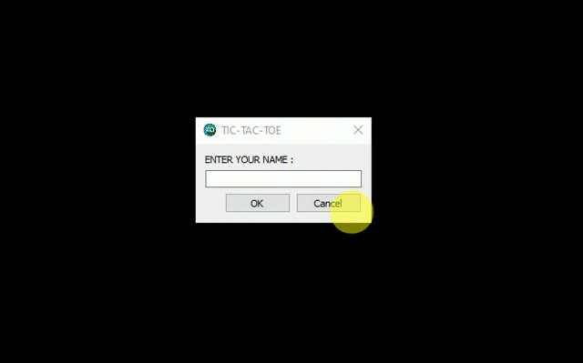
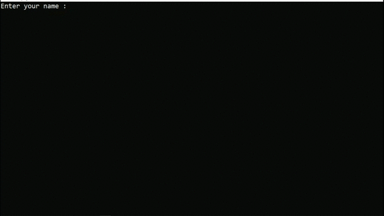

# tic-tac-toe

Install -> https://github.com/Sathvik-Rao/tic-tac-toe/archive/main.zip

It can be played on Terminal or GUI (graphical user interface).

**GUI**
```
code -> GUI\tic-tac-toe_QT_Code (QT Creator)
play -> GUI\tic-tac-toe_Windows\tic-tac-toe_windows_32bit\tic-tac-toe.exe (32bit/64bit Windows 10)
        GUI\tic-tac-toe_Windows\tic-tac-toe_windows_64bit\tic-tac-toe.exe (64bit Windows 10)
```

**Terminal**
```
code -> Terminal\Tic-Tac-Toe.cpp
play -> compile(Tic-Tac-Toe.cpp) and run(Tic-Tac-Toe.exe (or) a.out (or) ...)
```

**Gameplay**
```
The game is played on a grid that's 3 squares by 3 squares.
You are X/O, your friend (or the computer in this case) is O/X. Players take turns putting their marks in empty squares.
The first player to get 3 of his/her marks in a row (up, down, across, or diagonally) is the winner.
When all 9 squares are full, the game is over. If no player has 3 marks in a row, the game ends in a tie/draw.
```

-------------------------------------------------------------------------------------------------------------------

###### GUI Gameplay


-------------------------------------------------------------------------------------------------------------------

###### Terminal Gameplay

